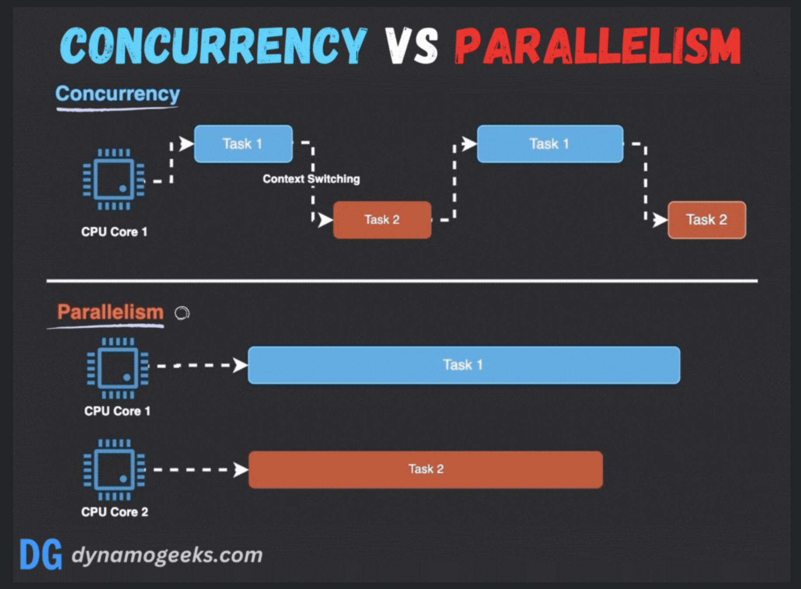

# 동시성과 병렬성

## 동시성(Concurrency)이란?
- 동시성은 한 번에 많은 것을 처리하는 것입니다.
- 동시성이란 이름처럼 실제로 여러 작업을 동시에 수행하는 것이 아니라, 논리적으로 동시에 실행되는 것처럼 보이게 만드는 개념입니다. 단일 코어를 기준으로 시간 분할을 통해 여러 스레드를 번갈아 가며 작업을 수행함으로써, 마치 동시에 여러 작업이 처리되는 것처럼 보이게 합니다.
- 특징
  - 작업 전환: 동시성은 종종 스레딩 및 비동기 프로그래밍과 같은 메커니즘을 사용하여 서로 다른 작업 간에 컨텍스트를 전환합니다. 이를 통해 단일 CPU가 시간을 나누어 여러 작업을 처리할 수 있습니다.
  - 리소스 공유에 초점: 동시성은 메모리와 데이터 변수와 같은 리소스의 공유 사용을 충돌 없이 관리해야 하며, 이를 위해 종종 정교한 동기화 기술이 필요합니다.
  - 단일 또는 다중 코어에 적용 가능: 동시성은 별도의 스레드나 작업을 여러 코어에 위임하여 여러 코어에서 이점을 얻을 수 있지만, 여러 작업의 실행 단계를 끼워 넣어 단일 코어 내에서 구현할 수도 있습니다.

## 병렬성(Parallelism)이란?
- 병렬성은 여러 작업을 동시에 수행하는 것입니다.
- 여러 처리 장치가 있는 하드웨어가 필요합니다. 병렬 컴퓨팅에서 작업은 서로 다른 프로세서에서 동시에 처리되는 더 작은 하위 작업으로 나뉩니다. 조립 라인에 여러 명의 작업자가 있는 것과 같으며, 각자가 동시에 작업의 일부를 수행합니다.
- 특징
  - 동시 처리: 병렬 처리란 여러 프로세스가 서로 다른 처리 장치에서 동시에 실행되는 것을 의미하며, 이를 통해 실행 속도가 획기적으로 향상됩니다. 특히 독립적인 하위 작업으로 나눌 수 있는 계산 작업의 경우 속도가 크게 향상됩니다.
  - 성능 효율성에 초점: 병렬성은 작업을 여러 코어에 분산시킴으로써 작업 집합의 완료 시간을 최소화하는 것을 목표로 하며, 이는 고성능 컴퓨팅 작업에 이상적입니다.
  - 다중 코어 아키텍처가 필요합니다. 단일 프로세서에서 구현할 수 있는 동시성과 달리 병렬성은 진정한 동시 실행을 달성하기 위해 여러 개의 처리 장치가 필요합니다.