# Docker 기초 정리

> 목표: Docker 명령어를 외우기보다 **왜 Docker가 필요한지**, 그리고 **Source Code → Image → Registry → Container** 흐름을 이해한다.

---

## 1. Docker가 없던 시절

예를 들어 NestJS 애플리케이션을 서버에 배포한다고 생각해보자.

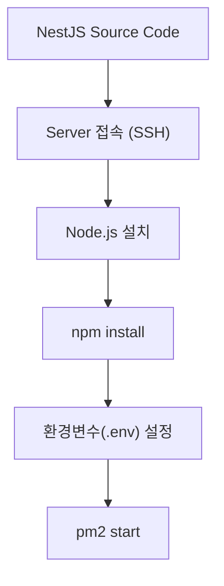

애플리케이션을 실행하려면 서버에도 실행 환경을 직접 구성해야 한다.

예를 들어 서버마다 환경이 아래처럼 다를 수 있다.

```text
Server 1
├── Node 22
└── PM2

Server 2
├── Node 20
└── PM2

Server 3
├── Node 18
└── PM2
```

이러면 같은 소스 코드라도 특정 서버에서만 문제가 발생할 수 있다.

또 여러 종류의 애플리케이션을 하나의 서버에서 운영하다 보면 서버 자체가 복잡해진다.

```text
Server
├── Java 17
├── Node 22
├── Python
├── Redis
└── Nginx
```

### 기존 방식의 문제

- 서버마다 실행 환경이 달라질 수 있다.
- Node / Java 등의 버전 차이로 장애가 발생할 수 있다.
- 애플리케이션마다 필요한 패키지를 서버에 직접 설치해야 한다.
- 새로운 서버를 만들 때 동일한 환경을 다시 구성해야 한다.
- 개발 환경에서는 되는데 운영 서버에서는 안 되는 문제가 생기기 쉽다.

---

# 2. Docker가 해결하려는 문제

Docker의 핵심 아이디어는 간단하다.

> **서버 환경을 애플리케이션에 맞추는 대신, 애플리케이션 실행 환경을 함께 포장한다.**

예를 들어 NestJS 애플리케이션이라면 다음과 같은 실행 환경을 하나로 묶는다.

```text
NestJS Application
│
├── Node.js
├── npm dependencies
├── Application Source
└── 실행 설정
```

이렇게 만들어진 결과물이 **Docker Image**다.

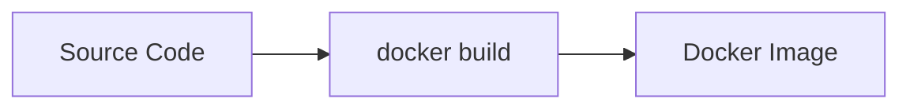

---

# 3. Docker Image란?

Docker Image는 애플리케이션을 실행하기 위한 **설계도 / 실행 패키지**라고 이해하면 된다.

예를 들어 NestJS Image 안에는 다음과 같은 내용이 포함될 수 있다.

```text
Docker Image
│
├── Base Image
│   └── Node 22
│
├── package.json
├── node_modules / 설치된 dependency
├── dist
└── 실행 명령
    └── node dist/main.js
```

비유하면 다음과 비슷하다.

```text
Windows ISO
설치 USB
실행 프로그램 패키지
```

중요한 점은 **Image 자체는 실행 중인 프로그램이 아니라는 것**이다.

---

# 4. Image와 Container

Docker에서 가장 중요한 개념이다.

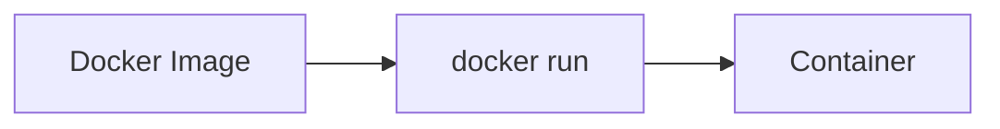

- **Image**: 실행하기 위한 설계도
- **Container**: Image를 실제로 실행한 상태

일반 프로그램에 비유하면 다음과 비슷하다.

```text
실행파일(exe)
    ↓
실행
    ↓
Process
```

Docker에서는

```text
Image
    ↓
docker run
    ↓
Container
```

이다.

---

## 하나의 Image로 여러 Container를 만들 수 있다

하나의 NestJS Image가 있다고 하자.

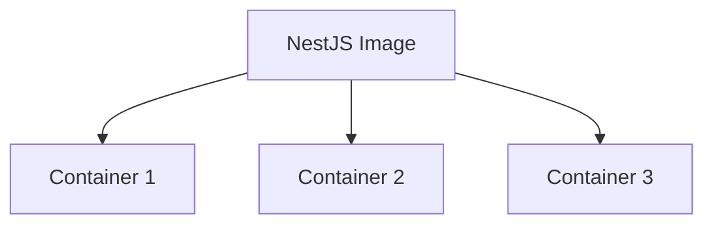

즉 같은 애플리케이션을 여러 개 실행할 수 있다.

```text
NestJS Image v1.0
│
├── Container 1
├── Container 2
└── Container 3
```

이 개념은 이후 Kubernetes의 **Replica / Pod**를 이해할 때 매우 중요하다.

---

# 5. Docker Build

Source Code를 Docker Image로 만드는 작업이 `docker build`다.

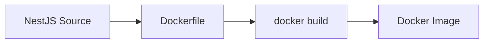

Dockerfile에는 대략 다음과 같은 내용이 들어간다.

```dockerfile
FROM node:22

WORKDIR /app

COPY package*.json ./

RUN npm install

COPY . .

RUN npm run build

CMD ["node", "dist/main.js"]
```

의미를 개념적으로 보면 다음과 같다.

```text
Node 22 환경을 준비한다
        ↓
소스 코드를 넣는다
        ↓
dependency를 설치한다
        ↓
빌드한다
        ↓
실행 명령을 지정한다
```

그리고

```bash
docker build -t server:1.0 .
```

을 실행하면

```text
server:1.0
```

이라는 Image가 만들어진다.

---

# 6. Container Registry

Image를 만들었다면 다른 서버에서도 사용할 수 있어야 한다.

Image를 저장하는 공간을 **Container Registry**라고 한다.

대표적으로 다음과 같은 서비스가 있다.

```text
Docker Hub
GitHub Container Registry
NCP Container Registry
AWS ECR
```

Git과 비교하면 이해하기 쉽다.

| 대상 | 저장소 |
|---|---|
| Source Code | Git Repository |
| Docker Image | Container Registry |

즉,

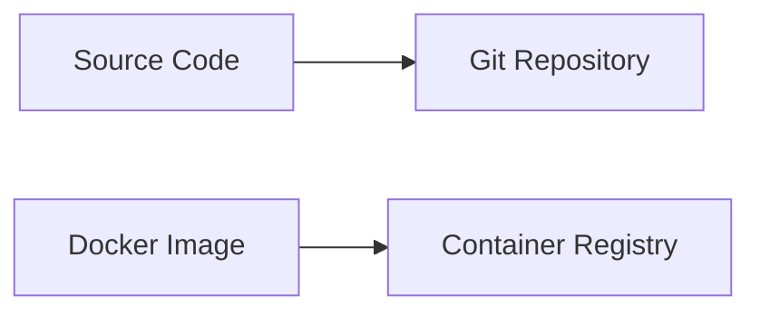

이다.

---

# 7. 실제 Docker 배포 흐름

개발자가 코드를 Push하면 CI가 Docker Image를 만든다고 생각해보자.

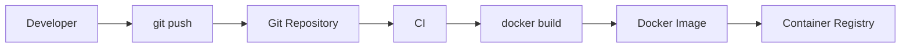

여기까지는 **Image를 만드는 과정**이다.

그 다음 운영 서버에서는 Registry에서 Image를 받아 실행한다.

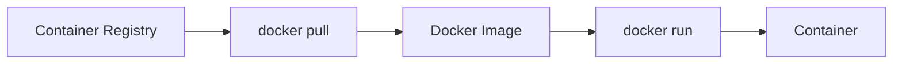

전체를 합치면 다음과 같다.

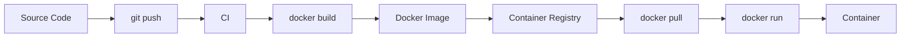

이 그림이 Docker에서 가장 중요한 흐름이다.

> **코드 → 이미지 → 저장소 → 실행**

---

# 8. NCP 환경에 대입

NCP를 사용한다면 대략 다음 구조가 된다.

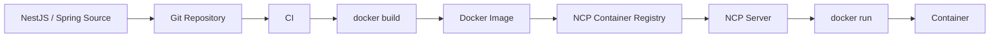

즉 NCP Container Registry의 역할은 **소스 저장소가 아니라 Docker Image 저장소**다.

---

# 9. Docker의 역할은 어디까지인가?

Docker는 애플리케이션의 실행 환경을 Image로 만들고 Container로 실행하는 문제를 해결한다.

하지만 Docker만 사용하면 아직 사람이 해야 하는 일이 남는다.

예를 들어 서버가 10대라면?

```text
Server 1 → docker run
Server 2 → docker run
Server 3 → docker run
...
Server 10 → docker run
```

Container 하나가 죽었다면?

```text
사람이 확인
    ↓
docker run
```

새로운 버전으로 교체하려면?

```text
docker pull

docker stop

docker run
```

결국 **여러 Container를 운영하는 문제**가 남는다.

---

# 10. 그래서 Kubernetes가 등장한다

Docker가 해결하는 문제:

> **애플리케이션을 어떻게 동일한 환경으로 실행할 것인가?**

Kubernetes가 해결하는 문제:

> **수많은 Container를 누가 관리할 것인가?**

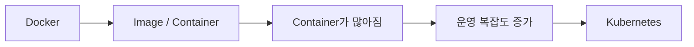

사람이 직접

```bash
docker run
```

을 반복하는 대신 Kubernetes에게 원하는 상태를 알려준다.

예를 들어:

```text
NestJS Container를
3개 실행해줘.
```

그러면 Kubernetes가 Container를 적절한 서버에 배치하고 관리한다.

이 부분부터 다음 학습 주제인 **Kubernetes**로 이어진다.

---

# 11. 반드시 기억할 핵심 용어

| 용어 | 의미 |
|---|---|
| Source Code | NestJS, Spring 등의 애플리케이션 코드 |
| Dockerfile | Image를 어떻게 만들지 정의한 파일 |
| Docker Image | 애플리케이션 실행 환경을 포장한 설계도 |
| Container | Image를 실제 실행한 상태 |
| Container Registry | Docker Image를 저장하는 저장소 |
| `docker build` | Source → Image |
| `docker push` | Image → Registry |
| `docker pull` | Registry → Image 다운로드 |
| `docker run` | Image → Container 실행 |

---

# 12. Docker 전체 개념 한 장 요약

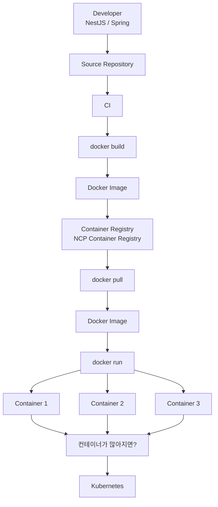

---

# 핵심 한 문장

> **Docker는 애플리케이션과 실행 환경을 Image로 만들고, 그 Image를 어디서든 동일하게 Container로 실행할 수 있게 해준다.**

그리고 다음 질문이 Kubernetes의 시작이다.

> **Container가 수십 개, 수백 개가 되면 누가 이걸 실행하고 관리할까?**

→ **Kubernetes**
