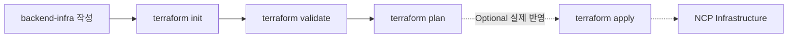
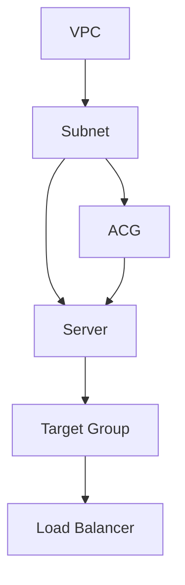
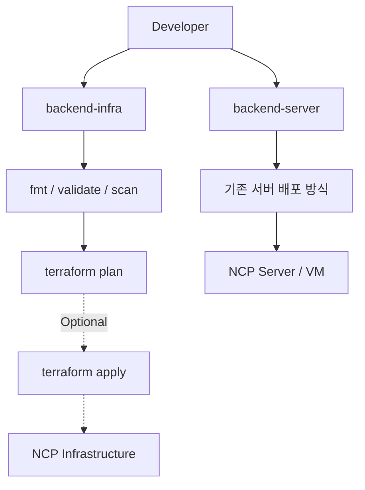
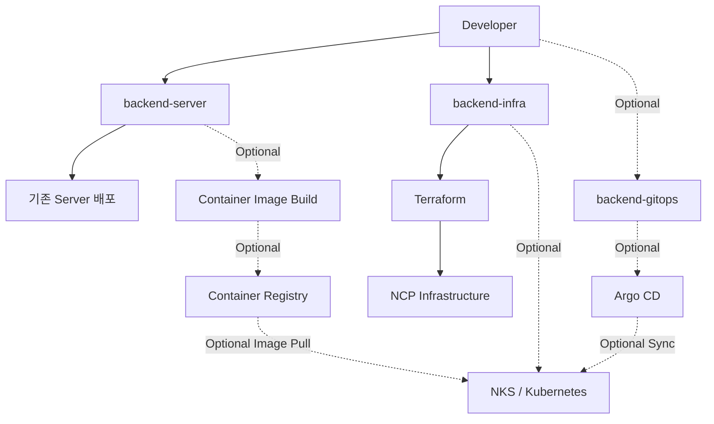
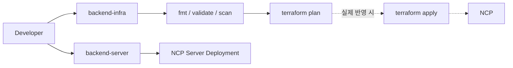
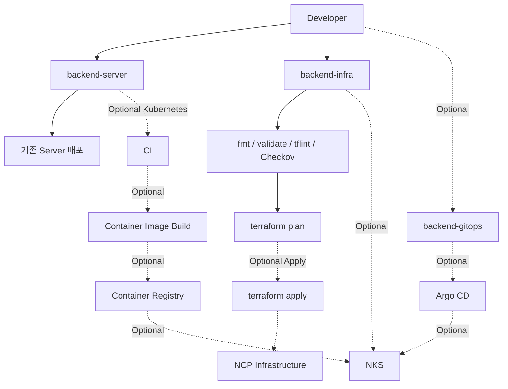
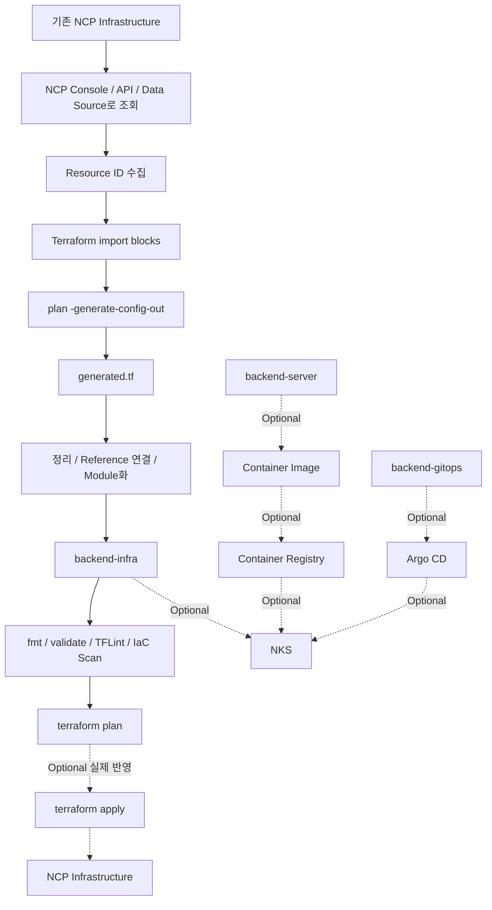

# IaC + NCP Terraform + GitOps 정리 v4

## 0. 이 문서의 전제

이 문서는 **NCP에서 IaC(Terraform)를 먼저 도입하고**, 필요할 경우에만 **Kubernetes/NKS + GitOps**까지 확장하는 흐름을 설명한다.

가장 중요한 기준은 다음과 같다.

```text
기본
────────────────────────────
backend-server
backend-infra (Terraform)

Optional
────────────────────────────
backend-gitops
Kubernetes / NKS
Argo CD
Container Image / Registry
```

즉, **Terraform을 도입한다고 Kubernetes를 반드시 써야 하는 것은 아니다.**

---

# 1. 추천 Repository 구조

기본 구성:

```text
SourceCommit

├── backend-server        # 애플리케이션 코드
└── backend-infra         # Terraform
```

Kubernetes / GitOps까지 도입할 경우:

```text
SourceCommit

├── backend-server        # 애플리케이션 코드
├── backend-infra         # Terraform
└── backend-gitops        # Helm / Kubernetes manifest (Optional)
```

역할은 다음과 같다.

```text
backend-server
→ 실제 백엔드 애플리케이션 코드

backend-infra
→ Terraform
→ VPC / Subnet / ACG / Server / LB / VPN / NKS 등

backend-gitops
→ Kubernetes Deployment / Service / Helm values
→ Argo CD가 감시
→ Kubernetes를 쓸 때만 필요
```

---

# 2. IaC란?

IaC = Infrastructure as Code.

기존에는 NCP Console에서 사람이 직접 다음과 같은 작업을 한다.

```text
VPC 생성
→ Subnet 생성
→ ACG 생성
→ Server 생성
→ Load Balancer 생성
```

IaC에서는 이를 코드로 정의한다.

```hcl
resource "ncloud_vpc" "main" {
  name            = "main-vpc"
  ipv4_cidr_block = "10.0.0.0/16"
}
```

Terraform은 이 코드를 기준으로 NCP API를 호출한다.

```text
backend-infra
      │
      ▼
Terraform
      │
      ▼
NCP API
      │
      ▼
VPC / Subnet / Server / LB ...
```

---

# 3. IaC의 핵심 장점

## 3.1 재현 가능

같은 Terraform 코드를 기반으로 환경을 반복 생성할 수 있다.

```text
          Terraform Module
                │
       ┌────────┼────────┐
       ▼        ▼        ▼
      DEV      STAGE     PROD
```

---

## 3.2 변경 이력을 Git으로 관리

```text
Terraform 수정
    ↓
Git Commit
    ↓
Pull Request
    ↓
Review
    ↓
terraform plan
    ↓
terraform apply
```

누가, 언제, 왜 인프라를 변경했는지 추적하기 쉬워진다.

---

## 3.3 변경 전에 확인 가능

```bash
terraform plan
```

예:

```text
+ VPC 생성
+ Subnet 생성
~ Load Balancer 변경
- ACG 삭제
```

개념적으로:

```text
terraform plan  ≈ git diff
terraform apply ≈ 실제 반영
```

---

# 4. Terraform 기본 흐름



### init

```bash
terraform init
```

Provider와 Module을 준비한다.

### validate

```bash
terraform validate
```

Terraform 문법과 설정을 검사한다.

### plan

```bash
terraform plan
```

실제 변경사항을 미리 확인한다.

### apply

```bash
terraform apply
```

실제 NCP 인프라에 반영한다.

> 학습이나 설계 검토 단계에서는 `plan`까지만 진행해도 된다.

---

# 5. NCP Terraform Provider

예:

```hcl
terraform {
  required_providers {
    ncloud = {
      source = "NaverCloudPlatform/ncloud"
    }
  }
}

provider "ncloud" {
  region      = "KR"
  site        = "public"
  support_vpc = true
}
```

공공존이라면:

```hcl
provider "ncloud" {
  region      = "KR"
  site        = "gov"
  support_vpc = true
}
```

Credential은 코드에 직접 넣지 않는다.

```bash
export NCLOUD_ACCESS_KEY="..."
export NCLOUD_SECRET_KEY="..."
export NCLOUD_REGION="KR"
```

---

# 6. Terraform State

Terraform은 세 가지를 비교한다.

```text
Terraform Code
    │
    ▼
원하는 상태(Desired State)

Terraform State
    │
    ▼
Terraform이 알고 있는 현재 상태

NCP
    │
    ▼
실제 인프라 상태
```

예:

```text
Code  : Server 3대
State : Server 2대
```

그러면 plan에서:

```text
+ Server 1대
```

같은 결과가 나온다.

---

# 7. 기존 NCP 인프라를 Terraform으로 가져오기

Terraform을 도입한다고 기존 NCP 인프라를 전부 삭제할 필요는 없다.

```text
현재 NCP Resource
      │
      │ terraform import
      ▼
Terraform State
      │
      ▼
Terraform 관리 대상
```

예:

```hcl
resource "ncloud_vpc" "main" {
  name            = "main-vpc"
  ipv4_cidr_block = "10.0.0.0/16"
}
```

기존 VPC 번호가 `12345`라고 하면:

```bash
terraform import ncloud_vpc.main 12345
```

확인:

```bash
terraform state list
terraform plan
```

---

# 8. 기존 NCP를 Terraform으로 전환하는 권장 순서

```text
1. VPC
2. Subnet
3. Route / NAT
4. ACG / Network ACL
5. Server
6. Block Storage
7. Load Balancer
8. Target Group
9. DB
10. 필요 시 NKS
```

의존성 예:



---

# 9. 운영 환경 Import 시 주의점

처음부터 `apply`를 하지 않는다.

```text
Import
  ↓
terraform plan
  ↓
실제 NCP와 차이 확인
  ↓
Terraform 코드 수정
  ↓
다시 plan
  ↓
변경 없음 또는 의도된 변경만 남음
  ↓
Terraform 관리 시작
```

특히:

```text
-/+ destroy and create replacement
```

가 나오면 운영 리소스에서는 매우 주의해야 한다.

---

# 10. Terraform 코드 Scan

Terraform Scan은 기존 NCP Resource 검색과 다른 개념이다.

보통 다음처럼 사용한다.

```text
terraform fmt
      ↓
terraform validate
      ↓
TFLint
      ↓
Checkov / Trivy IaC Scan
      ↓
terraform plan
```

예:

```bash
terraform fmt -check
terraform init
terraform validate

tflint

checkov -d .

terraform plan
```

역할:

| 도구 | 역할 |
|---|---|
| terraform fmt | 코드 포맷 검사 |
| terraform validate | Terraform 문법/구조 검사 |
| TFLint | Terraform 품질 및 Provider Rule 검사 |
| Checkov / Trivy | IaC 보안 정책 검사 |
| terraform plan | 실제 NCP 변경사항 확인 |

---

# 11. 기본 운영 구조: Kubernetes 없이

Kubernetes를 쓰지 않는다면 구조는 여기서 끝나도 된다.



애플리케이션 배포는 기존 방식 그대로 유지할 수 있다.

예:

```text
backend-server
   ↓
Build
   ↓
NCP Server
   ↓
PM2 / systemd / java -jar 등
```

즉:

```text
Terraform 사용
≠
Docker 필수

Terraform 사용
≠
Kubernetes 필수

Terraform 사용
≠
GitOps 필수
```

---

# 12. Kubernetes / GitOps는 Optional

Kubernetes를 도입하고 싶을 때만 다음 영역을 추가한다.

```text
backend-gitops
NKS
Argo CD
Container Image
Container Registry
```

전체 그림:



점선 영역은 **Kubernetes를 도입할 때만 필요한 경로**다.

---

# 13. backend-gitops란?

`backend-gitops`는 애플리케이션 소스코드 저장소가 아니다.

Kubernetes에 다음을 선언하는 저장소다.

```text
어떤 Image를 실행할지
Replica를 몇 개 띄울지
어떤 Service Port를 사용할지
Ingress를 어떻게 구성할지
환경별 설정은 무엇인지
```

예:

```text
backend-gitops/
├── dev/
│   └── values.yaml
├── stage/
│   └── values.yaml
└── prod/
    └── values.yaml
```

예시:

```yaml
image:
  repository: registry.example.com/backend-server
  tag: "1.5.3"

replicaCount: 3

service:
  type: ClusterIP
  port: 3000
```

하지만 다시 강조하면:

> Kubernetes를 사용하지 않는다면 `backend-gitops` 저장소 자체가 필요 없다.

---

# 14. GitOps란?

GitOps는 Git을 실행 환경의 **Desired State(Source of Truth)** 로 사용하는 운영 방식이다.

```text
backend-gitops
      │
      ▼
Git의 Desired State
      │
      ▼
Argo CD
      │
      ▼
Kubernetes 실제 상태와 비교
      │
      ▼
Sync
```

보통 Kubernetes 환경에서 Argo CD / Flux와 함께 사용한다.

---

# 15. Terraform과 GitOps의 차이

```text
Terraform
= Infrastructure Provisioning

GitOps
= Kubernetes Application Deployment / State Management
```

Terraform:

```text
backend-infra
    ↓
terraform plan
    ↓
terraform apply
    ↓
VPC / Subnet / Server / LB / NKS
```

GitOps:

```text
backend-gitops
    ↓
Argo CD
    ↓
Kubernetes / NKS
```

둘은 연결할 수 있지만 서로 필수 관계는 아니다.

---

# 16. 기본 권장 Architecture

현재 단계에서 가장 현실적인 구조:

```text
SourceCommit

├── backend-server
│      └── Backend Application
│
└── backend-infra
       └── Terraform
```

흐름:



이 구조만으로도 IaC 도입은 성립한다.

---

# 17. Kubernetes까지 확장한 Architecture (Optional)

필요해졌을 때 다음 구조로 확장한다.

```text
SourceCommit

├── backend-server
├── backend-infra
└── backend-gitops        # Optional
```

전체 흐름:



---

# 18. 비용을 최소화한 학습 방법

가장 먼저 할 범위:

```text
backend-infra 작성
      ↓
terraform init
      ↓
terraform fmt -check
      ↓
terraform validate
      ↓
TFLint / Checkov
      ↓
terraform plan
```

여기까지는 실제 NCP Resource를 만들지 않는 방향으로 학습할 수 있다.

그 다음 실제 테스트가 필요하면:

```text
terraform apply
```

를 사용한다.

Kubernetes가 필요하지 않다면 아래는 전부 생략 가능하다.

```text
NKS
Docker / Container Image
Container Registry
backend-gitops
Argo CD
Kubernetes Manifest
Helm
```

---

# 19. 도입 순서 추천

## STEP 1 — Terraform 기본

```text
backend-infra
```

에서:

```bash
terraform init
terraform validate
terraform plan
```

---

## STEP 2 — 작은 NCP Resource로 실습

```text
VPC
Subnet
```

정도로 시작한다.

필요할 때만:

```bash
terraform apply
```

---

## STEP 3 — 기존 NCP Resource Import

```text
VPC
→ Subnet
→ ACG
→ Server
→ LB
```

순으로 조금씩 Terraform 관리 대상으로 가져온다.

---

## STEP 4 — Git + CI

```text
backend-infra PR
       ↓
terraform fmt
       ↓
terraform validate
       ↓
TFLint / Checkov
       ↓
terraform plan
       ↓
Review
```

---

## STEP 5 — 여기까지가 기본 목표

```text
SourceCommit

├── backend-server
└── backend-infra
```

Terraform 기반 IaC 도입 완료.

---

## STEP 6 — Kubernetes 필요 여부 판단

다음 요구사항이 생기면 검토한다.

```text
컨테이너 기반 표준 배포
Auto Scaling
Rolling Update
Service Discovery
여러 서비스 운영
GitOps 배포 자동화
```

그때:

```text
backend-gitops
NKS
Argo CD
```

를 추가한다.

---

## STEP 7 — Kubernetes / GitOps PoC (Optional)

```text
backend-server
      ↓
Container Image
      ↓
Registry
      ↓
NKS

backend-gitops
      ↓
Argo CD
      ↓
NKS
```

---

# 20. 최종적으로 기억할 그림

## 기본

```text
                 SourceCommit
                      │
          ┌───────────┴───────────┐
          │                       │
   backend-server           backend-infra
          │                       │
          │                   Terraform
          │                       │
          ▼                       ▼
    기존 서버 배포            NCP Infrastructure
```

## Optional Kubernetes / GitOps

```text
                 SourceCommit
                      │
       ┌──────────────┼──────────────┐
       │              │              │
backend-server   backend-infra   backend-gitops
       │              │              │
       │          Terraform           │
       │              │           Argo CD
       │              │              │
       │              ▼              ▼
       │             NKS ◀────────────┘
       │              ▲
       │              │
       └ - - Image / Registry - - - ┘
               Optional
```

---

# 21. 핵심 결론

```text
IaC
→ 인프라를 코드로 관리

Terraform
→ NCP 인프라를 생성 / 변경 / Import / 관리

Kubernetes
→ 컨테이너 실행 및 운영 플랫폼
→ Optional

GitOps
→ Git을 Kubernetes Desired State로 사용하는 운영 방식
→ Optional

Argo CD
→ Kubernetes GitOps 도구
→ Optional
```

따라서 현재 단계에서는:

```text
backend-server
+
backend-infra
```

만으로도 충분히 좋은 IaC 도입 구조다.

필요성이 생겼을 때만:

```text
backend-gitops
+
NKS
+
Argo CD
```

를 추가한다.


---

# 22. 기존 NCP를 Scan해서 `backend-infra` 초안 만들기

지금까지는 `backend-infra`를 직접 작성하는 흐름을 설명했다.

하지만 이미 NCP Console에서 운영 중인 인프라가 있다면 다음 방식으로 접근할 수 있다.

```text
기존 NCP
   ↓
Resource 조회 / Scan
   ↓
Resource ID 수집
   ↓
Terraform import block 작성
   ↓
terraform plan -generate-config-out
   ↓
generated.tf 생성
   ↓
코드 정리 / 모듈화
   ↓
backend-infra
```

핵심은 다음과 같다.

> 기존 NCP 인프라를 조회해서 Resource ID를 확보한 뒤,
> Terraform에게 해당 Resource를 Import 대상으로 알려주고
> `.tf`의 초기 형태를 생성하게 한다.

이 방법은 **처음부터 모든 Terraform 코드를 손으로 작성하는 부담을 줄이는 용도**로 사용할 수 있다.

---

# 23. Scan의 의미

여기서 `Scan`은 두 가지 의미를 구분해야 한다.

## A. 현재 NCP Resource 찾기

```text
NCP
↓
어떤 VPC가 있는가?
어떤 Subnet이 있는가?
어떤 Server가 있는가?
어떤 LB가 있는가?
```

이를 조회하는 단계다.

방법은 다음과 같다.

```text
NCP Console
NCP CLI / API
Terraform Data Source
```

예를 들어 NCP Terraform Provider에는 기존 Server 목록을 조회할 수 있는 Data Source들이 제공된다.

개념적으로:

```hcl
data "ncloud_servers" "all" {
}
```

조회된 정보를 기반으로 실제 Terraform 관리 대상으로 가져올 Resource를 결정한다.

> Data Source는 Resource를 Terraform이 "관리"하게 만드는 것이 아니다.
> 기존 NCP 정보를 읽어오는 용도다.

---

## B. Terraform 코드 생성

Resource ID를 알게 되었다면 Terraform `import` block을 작성한다.

예:

```hcl
import {
  to = ncloud_server.backend
  id = "12345"
}
```

Terraform 1.5 이상에서는 해당 Resource Block이 아직 없어도 다음 명령을 사용할 수 있다.

```bash
terraform plan -generate-config-out=generated.tf
```

그러면 Terraform이 Provider에서 읽어온 Resource 정보를 바탕으로:

```text
generated.tf
```

초안을 생성한다.

---

# 24. 실제 예제 — 기존 Server 가져오기

현재 NCP에 다음 Server가 있다고 가정한다.

```text
Server Name : backend-server-01
Instance No : 12345
```

먼저 `backend-infra`를 만든다.

```text
backend-infra/
├── provider.tf
└── imports.tf
```

---

## provider.tf

```hcl
terraform {
  required_providers {
    ncloud = {
      source = "NaverCloudPlatform/ncloud"
    }
  }
}

provider "ncloud" {
  region      = "KR"
  site        = "public"
  support_vpc = true
}
```

공공존이면 환경에 맞게:

```hcl
site = "gov"
```

를 사용한다.

---

## imports.tf

```hcl
import {
  to = ncloud_server.backend
  id = "12345"
}
```

이 시점에는 다음 Resource Block이 없어도 된다.

```hcl
resource "ncloud_server" "backend" {
}
```

---

# 25. Terraform이 `.tf` 초안 생성

초기화:

```bash
terraform init
```

그리고:

```bash
terraform plan \
  -generate-config-out=generated.tf
```

결과:

```text
backend-infra/
├── provider.tf
├── imports.tf
└── generated.tf
```

`generated.tf`에는 대략 다음과 같은 Resource가 생성된다.

```hcl
resource "ncloud_server" "backend" {
  name                = "backend-server-01"
  subnet_no           = "1234"
  server_image_number = "..."
  server_spec_code    = "..."
}
```

실제 생성 결과는 Provider Schema와 현재 NCP Resource 속성에 따라 달라진다.

---

# 26. generated.tf는 완성본이 아니다

여기가 매우 중요하다.

```text
generated.tf
≠
완성된 Terraform Architecture
```

Terraform은 Provider에서 얻은 정보를 기반으로 **초안**을 생성한다.

따라서 다음 작업이 필요하다.

```text
불필요한 Default 값 제거
Hard Coding 제거
Variable 추출
Resource Reference 연결
파일 분리
Module 구성
Naming 정리
Secret 제거
```

예를 들어 자동 생성된 코드가:

```hcl
resource "ncloud_server" "backend" {
  subnet_no = "98765"
}
```

라면 나중에는:

```hcl
resource "ncloud_server" "backend" {
  subnet_no = ncloud_subnet.backend.id
}
```

처럼 관계를 코드로 표현하는 것이 좋다.

---

# 27. 여러 Resource를 가져올 때

예를 들어 현재 NCP가:

```text
VPC
└── Subnet
    └── Server
```

구조라면 각각 ID를 찾는다.

예:

```text
VPC ID    = 100
Subnet ID = 200
Server ID = 300
```

`imports.tf`:

```hcl
import {
  to = ncloud_vpc.main
  id = "100"
}

import {
  to = ncloud_subnet.backend
  id = "200"
}

import {
  to = ncloud_server.backend
  id = "300"
}
```

그리고:

```bash
terraform plan \
  -generate-config-out=generated.tf
```

을 실행한다.

---

# 28. 생성된 코드를 `backend-infra` 구조로 정리

초기 생성:

```text
backend-infra/
├── provider.tf
├── imports.tf
└── generated.tf
```

정리 후:

```text
backend-infra/
├── provider.tf
├── versions.tf
├── variables.tf
├── outputs.tf
│
├── network/
│   ├── vpc.tf
│   └── subnet.tf
│
├── compute/
│   └── server.tf
│
├── security/
│   └── acg.tf
│
└── load-balancer/
    └── lb.tf
```

규모가 커지면 Module 형태로 발전시킨다.

```text
backend-infra/
├── modules/
│   ├── network/
│   ├── compute/
│   └── load-balancer/
│
└── environments/
    ├── dev/
    ├── stage/
    └── prod/
```

---

# 29. 권장 Scan → Import 순서

한꺼번에 모든 NCP Resource를 가져오기보다는 의존성 순서대로 진행하는 것을 권장한다.

```text
1. VPC
      ↓
2. Subnet
      ↓
3. Route / NAT / ACL
      ↓
4. ACG
      ↓
5. Server
      ↓
6. Storage
      ↓
7. Target Group
      ↓
8. Load Balancer
      ↓
9. DB
      ↓
10. Optional NKS
```

이유:

```text
Server → Subnet에 의존
Subnet → VPC에 의존
LB → Target Group에 의존
Target Group → Server에 의존
```

하기 때문이다.

---

# 30. Scan 후 가장 중요한 검증

Import / 코드 생성 후 바로 `apply`하지 않는다.

반드시:

```bash
terraform plan
```

을 다시 실행한다.

목표:

```text
Plan:
0 to add
0 to change
0 to destroy
```

또는 정말 의도한 변경만 존재하는 상태.

특히 다음 결과가 있으면 확인한다.

```text
destroy
replace
-/+
```

예:

```text
-/+ ncloud_server.backend
```

운영 Server에서 이런 결과가 나오면 그대로 apply하지 않는다.

---

# 31. 현실적인 NCP Scan 자동화 수준

이상적인 형태는:

```text
NCP 전체 Scan
     ↓
모든 Resource 자동 발견
     ↓
완벽한 Terraform 코드 자동 생성
     ↓
backend-infra 완성
```

이지만 실제로는 Provider별 지원 차이가 있다.

따라서 NCP에서는 현재 다음 흐름을 기본으로 생각하는 것이 안전하다.

```text
NCP Console / API / Data Source
           ↓
      Resource 조회
           ↓
         ID 수집
           ↓
      import block
           ↓
terraform plan -generate-config-out
           ↓
       generated.tf
           ↓
       개발자가 검토
           ↓
      backend-infra
```

Terraform 자체에는 `terraform query`를 이용하여 Provider가 지원하는 Resource들을 대량 조회하고
Import Configuration을 생성하는 기능도 존재한다.

개념:

```bash
terraform query \
  -generate-config-out=generated.tf
```

하지만 이 Bulk Discovery 방식은 **사용하는 Terraform Provider가 Resource Query/List 기능을 지원해야 한다.**

따라서 NCP Provider에서 대상 Resource가 이를 지원하는지 확인하지 않고
`terraform query` 기반 전체 Scan을 전제로 설계하면 안 된다.

현재 실무 도입의 안전한 기준은:

```text
NCP Resource 조회
+
import block
+
generate-config-out
```

이다.

---


# 32. 전체 도입 흐름

최종적으로 전체 과정을 한 장으로 보면 다음과 같다.



---


# 33. 기억할 핵심

### 새 인프라를 만드는 경우

```text
backend-infra 직접 작성
      ↓
terraform plan
      ↓
terraform apply
```

### 이미 NCP에 인프라가 존재하는 경우

```text
NCP 조회 / Scan
      ↓
Resource ID
      ↓
import block
      ↓
generate-config-out
      ↓
generated.tf
      ↓
코드 정리
      ↓
backend-infra
```

그리고 Kubernetes를 사용하지 않는다면:

```text
backend-server
+
backend-infra
```

까지만 운영해도 된다.

아래는 계속 Optional이다.

```text
backend-gitops
NKS
Argo CD
Container Image
Container Registry
```


즉 미리 주어진 현재 전체 방향은:

> **기존 NCP를 파악해서 Terraform 코드의 초안을 만들고,
> 이를 `backend-infra`로 정리한 뒤 Git에서 관리한다.
> Kubernetes / GitOps는 필요할 때만 추가한다.**
