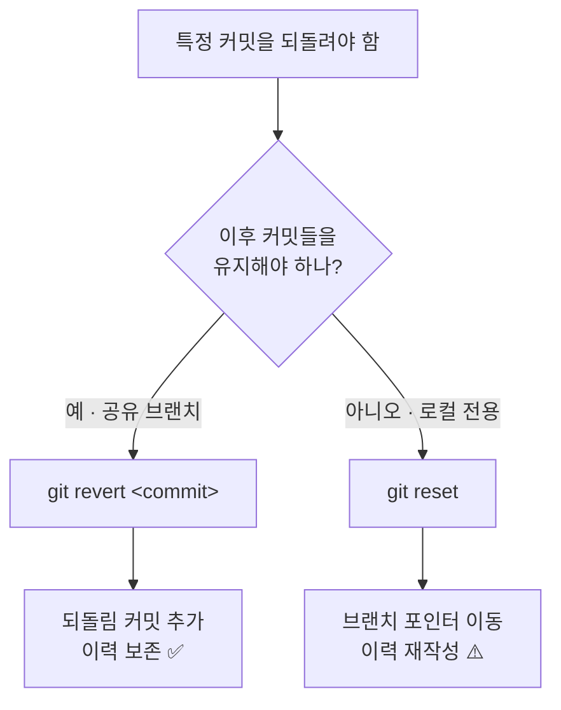
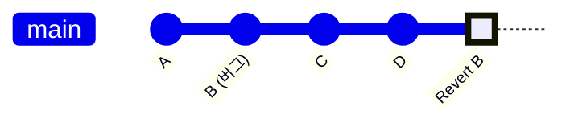

# Git 단일 커밋 되돌리기 (이후 변경은 그대로)

> 한 줄 요약: **`git revert <commit>`** 를 쓴다. `git reset` 아님.
> revert 는 **새 커밋을 추가**해 특정 커밋만 무효화하므로, 그 뒤 커밋과 이력이 그대로 보존된다.

---

## ⚡ TL;DR 치트시트

```bash
# 1. 되돌릴 커밋 해시 찾기
git log --oneline

# 2. 그 커밋만 되돌리기 (새 "되돌림 커밋" 생성)
git revert <commit-hash>

# 3. 공유 브랜치에 반영
git push
```

이게 전부다. 아래는 상황별 옵션과 주의사항.

---

## 🧠 왜 reset 이 아니라 revert 인가

| | `git revert` ✅ | `git reset` ⚠️ |
|---|---|---|
| 동작 | 변경을 되돌리는 **새 커밋 추가** | 브랜치 포인터를 **과거로 이동** |
| 이후 커밋 | **유지됨** | **사라짐** (reset 대상 이후 전부) |
| 이력 | 보존 (협업 안전) | 재작성 (공유 브랜치에서 위험) |
| 푸시된 브랜치 | 안전 | `--force` 필요 → 동료 작업 깨짐 |
| 쓸 때 | 공유/원격 브랜치, 이미 푸시함 | 로컬 전용, 아직 푸시 안 함 |



---

## 📊 그림으로 보는 차이

### revert — 안전 (이력 보존)

```text
이전:  A ── B ── C ── D            ← HEAD
            ↑ 버그 커밋

이후:  A ── B ── C ── D ── B'      ← HEAD
            │              ↑ B의 변경만 되돌리는 새 커밋
            └ B 커밋도 그대로 남아있음 (C, D 영향 없음)
```

### reset — 위험 (이력 삭제)

```text
이전:  A ── B ── C ── D            ← HEAD
이후:  A ── B                      ← HEAD
                  ↑ C, D 가 통째로 사라짐 (커밋 이력 손실)
```

### Mermaid 커밋 그래프 (revert)



> `B (버그)` 는 히스토리에 남아 있고, 맨 끝에 `Revert B` 커밋이 추가되어 B의 변경만 무효화된다.

---

## 🛠️ 상황별 사용법

### 1) 커밋 하나만 되돌리기

```bash
git revert a1b2c3d
# 커밋 메시지 에디터가 열림 → 저장하면 되돌림 커밋 생성
```

에디터 건너뛰고 바로 커밋:

```bash
git revert --no-edit a1b2c3d
```

### 2) 여러 커밋을 한 번에 되돌려 하나의 커밋으로 합치기

`-n` (`--no-commit`) 은 커밋 없이 **변경만 스테이징**한다. 여러 번 모은 뒤 한 번에 커밋.

```bash
git revert -n a1b2c3d
git revert -n e4f5g6h
git commit -m "기능 X 관련 커밋 2개 되돌림"
```

### 3) 범위로 되돌리기

```bash
# OLD 는 제외, OLD 다음부터 NEW 까지 되돌림
git revert OLD..NEW

# 하나의 커밋으로 합치고 싶으면 -n 추가 후 직접 커밋
git revert -n OLD..NEW
git commit -m "범위 되돌림"
```

### 4) 변경만 작업 디렉터리에 남기고 직접 수정

```bash
git revert -n a1b2c3d
# 이제 되돌린 내용이 스테이징됨 → 추가 수정 후 원하는 대로 커밋
```

---

## 💥 충돌(conflict) 났을 때

revert 도중 충돌이 나면 멈춘다. 당황 금지.

```bash
# 1. 충돌 파일 직접 수정 (<<<<<<< ======= >>>>>>> 마커 정리)
# 2. 해결한 파일 스테이징
git add <충돌-파일>

# 3. 되돌림 마무리
git revert --continue
```

중간에 그만두려면:

```bash
git revert --abort     # 처음 상태로 완전 복구
git revert --skip      # 현재 커밋만 건너뛰고 다음으로 (범위 revert 시)
```

---

## 🔀 머지 커밋(merge commit) 되돌리기

머지 커밋은 부모가 둘이라 `-m` 으로 **기준 부모**를 지정해야 한다.

```bash
git revert -m 1 <merge-commit-hash>
```

- `-m 1` : 보통 머지를 받은 쪽(예: `main`). 대부분 이걸 쓴다.
- `-m 2` : 머지되어 들어온 쪽(피처 브랜치).

> ⚠️ 머지를 revert 한 브랜치를 나중에 다시 머지하면 변경이 안 들어올 수 있다. 재머지 전에 "revert 의 revert" 가 필요할 수 있으니 주의.

---

## ⚠️ 흔한 실수 & 주의

- **이미 푸시한 커밋에 `git reset --hard` 쓰지 말기** → 강제 푸시로 동료 이력이 깨진다. 공유 브랜치는 무조건 `revert`.
- **해시는 `git log --oneline` 으로 정확히 확인** — 짧은 해시(7자)면 충분.
- **revert 도 결국 커밋** — 푸시해야 원격에 반영된다.
- **여러 개 되돌릴 땐 최신 → 과거 순서**가 충돌이 적다.
- **revert 를 취소하고 싶으면?** 방금 만든 되돌림 커밋을 또 revert 하면 된다: `git revert <revert-커밋>`.

---

## 📌 명령어 빠른 참조

| 목적 | 명령어 |
|---|---|
| 커밋 해시 찾기 | `git log --oneline` |
| 단일 커밋 되돌리기 | `git revert <hash>` |
| 에디터 없이 | `git revert --no-edit <hash>` |
| 커밋 없이 변경만 | `git revert -n <hash>` |
| 범위 되돌리기 | `git revert OLD..NEW` |
| 머지 커밋 | `git revert -m 1 <merge-hash>` |
| 충돌 후 계속 | `git add . && git revert --continue` |
| 되돌리기 취소 | `git revert --abort` |

---

*참고: 
[WikiTwist](https://wikitwist.com/how-to-revert-a-single-git-commit-without-losing-later-changes/)
[Atlassian Git Tutorial](https://www.atlassian.com/git/tutorials/undoing-changes/git-revert)
[git-revert 공식 문서](https://git-scm.com/docs/git-revert)*
